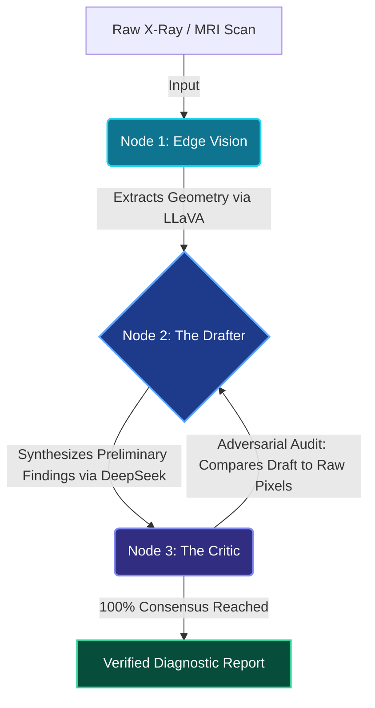

<div align="center">
  <table border="0" cellpadding="0" cellspacing="0">
    <tr>
      <td align="center" valign="middle">
        
      </td>
      <td align="left" valign="middle" style="padding-left: 20px;">
        <h1 style="border-bottom: none; margin: 0; padding: 0; line-height: 1;">HYPERION</h1>
        <p style="margin: 5px 0 0 0; padding: 0; color: #00D9FF; font-weight: bold; letter-spacing: 2px; font-size: 14px; text-transform: uppercase;">Clinical AI Engine</p>
      </td>
    </tr>
  </table>
  <br/>
  <p><strong>Radiology, Redefined by Consensus.</strong></p>
  <p>An edge-native, adversarial AI swarm designed to extract, draft, and aggressively verify clinical findings in milliseconds—completely offline.</p>
</div>

---

## ⚡ The Core Problem

Standard medical AI relies on single, massive transformer models. When you force one model to simultaneously extract visual geometry (pixels) and synthesize clinical knowledge (text), the cognitive load causes **Hallucinations**. In a clinical setting, a hallucination isn't a bug; it's a critical liability.

## 🛡️ The Hyperion Solution

Hyperion abandons single-model frailty. Instead, it utilizes a localized **Adversarial Swarm Architecture**. Three independent agents handle distinct cognitive loads, verifying each other's outputs with mathematical precision before a final report is ever generated. Zero patient data ever leaves the room.

---

## 🧠 Swarm Architecture

The Hyperion Engine operates on a 3-Node localized network.



### 1. Edge Vision (LLaVA)
A lightweight, multimodal agent dedicated entirely to geometry extraction. It doesn't diagnose; it maps pixel variances natively on GPU hardware without internet access.

### 2. Drafter Node (DeepSeek)
Takes the raw structural data from the Vision Node and cross-references it against an embedded clinical knowledge base to write a preliminary impression.

### 3. Critic Override
An independent auditor checks the draft against the raw data, violently rejecting hallucinations. A report is only finalized when the network reaches 100% consensus.

---

## 🏢 Dual-Market Functionality

Hyperion ships with two distinct operational modes, easily toggled from the React HUD.

| Mode | Target Market | Functionality |
| :--- | :--- | :--- |
| **Clinical Diagnostic** | Hospitals & Clinics | Provides instantaneous, deterministic, and perfectly verified diagnostic reports for immediate clinical review. |
| **Edu: Discovery** | Academic Residencies | Interactive masking of results. Residents must type their findings first. Features a "Request Hint" pedagogical nudge powered by the Critic Node. |

---

## 🛠️ Technology Stack

* **Frontend:** React, Tailwind CSS v4, Framer Motion (Physics-based cinematic UI).
* **Backend Orchestration:** Node.js, Express, Multer (File Handling).
* **AI Engine:** Ollama (Local LLaVA execution), DeepSeek API (Reasoning Nodes).
* **Design System:** Deep-Space Glassmorphism, Custom SVG animated iconography.

---

## 🚀 The Monkey-Proof Installation Guide

Follow these exact steps to run the Hyperion Swarm on your local machine.

### Prerequisites
1. Install [Node.js](https://nodejs.org/en/) (v18+)
2. Install [Ollama](https://ollama.com/) (For local Vision processing)
3. Get a [DeepSeek API Key](https://platform.deepseek.com/)

### Step 1: Install the Vision Model
Open your terminal and pull the LLaVA model into your local Ollama instance:
```bash
ollama run llava
```
*(Once it downloads and says "success", type `/bye` to exit. Ollama is now running in the background).*

### Step 2: Clone & Setup the Codebase
```bash
# Clone the repository
git clone https://github.com/project-hyperion/core.git
cd project-hyperion-test

# Install Backend Dependencies
cd server
npm install

# Install Frontend Dependencies
cd ../client
npm install
```

### Step 3: Configure Environment Variables
Inside the `/server` folder, create a file named `.env`:
```bash
# /server/.env
PORT=3000
DEEPSEEK_API_KEY="your_api_key_here"
```

### Step 4: Ignite the Swarm
You will need two terminal windows to run both the frontend and backend simultaneously.

**Terminal 1 (The Backend Orchestrator):**
```bash
cd server
npm run dev
```

**Terminal 2 (The React HUD):**
```bash
cd client
npm run dev
```

Open `http://localhost:5173` in your browser. Welcome to the Engine Room.

---

## ⚖️ Legal & Medical Disclaimer

> [!WARNING]
> **Diagnostic Augmentation Only:** Hyperion is an assistive tool, not an autonomous diagnostic agent. A licensed medical practitioner must always review the 'Verified Consensus Report' before initiating patient treatment. The creators are not liable for clinical misdiagnoses.

**Privacy Note:** When deployed properly, Hyperion operates on a "Zero Data Retention" architecture. No Protected Health Information (PHI) is permanently stored or transmitted.
