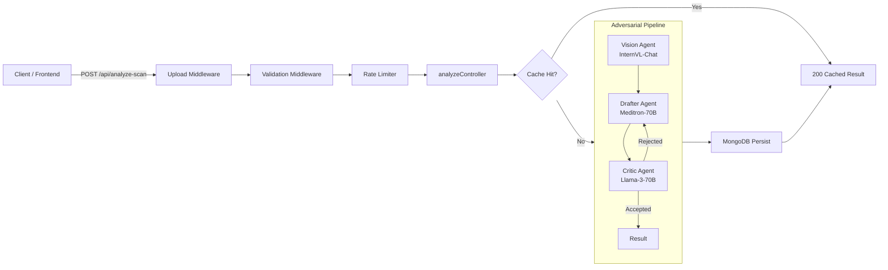
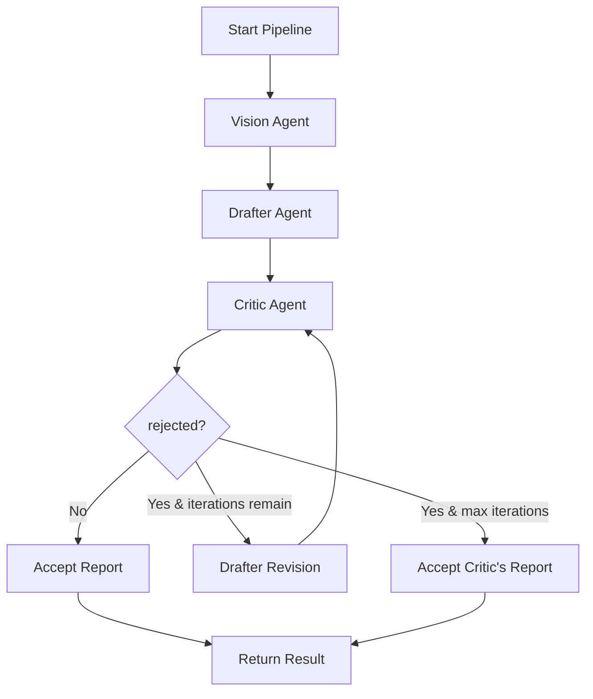
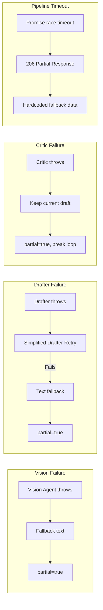

# Hyperion Medical AI Swarm — Architecture Evaluation & Diagnostic Report

## 1. System Overview

Hyperion is a **three-agent adversarial medical AI pipeline** that analyzes medical scan images (X-rays, CT, etc.) and produces a structured clinical assessment. The system uses local vLLM-hosted LLMs in a **Vision → Drafter → Critic** chain with an optional revision loop.

### High-Level Architecture



### Data Flow

```mermaid
sequenceDiagram
    participant C as Client
    participant A as analyzeController
    participant V as Vision Agent
    participant D as Drafter Agent
    participant CR as Critic Agent
    participant DB as MongoDB

    C->>A: POST /api/analyze-scan (image)
    A->>A: Check cache (imageHash)
    alt Cache Hit
        A->>C: 200 Cached Result
    else Cache Miss
        A->>V: runVisionAgent(image)
        V-->>A: rawFindings (text)
        A->>D: runDrafterAgent(rawFindings)
        D-->>A: draftReport
        loop Up to N iterations
            A->>CR: runCriticAgent(draft, raw)
            CR-->>A: {verifiedReport, rejected, issues}
            alt rejected & iterations remain
                A->>D: runDrafterAgent(raw, issues) [revision]
                D-->>A: revised draft
            else accepted or max iterations
                break
            end
        end
        A->>DB: ScanResult.create()
        A->>C: 200/206 Result
    end
```

---

## 2. Agent-by-Agent Evaluation

### 2.1 Vision Agent ([`server/src/services/visionAgent.js`](server/src/services/visionAgent.js))

| Aspect | Assessment |
|--------|-----------|
| **Model** | `OpenGVLab/InternVL-Chat-V1-5-AWQ` — strong multimodal VLM |
| **Endpoint** | `/v1/chat/completions` (OpenAI-compatible) |
| **Retry** | 2 retries, 3s base delay, exponential backoff (max 16s) |
| **Temperature** | 0.1 (low — deterministic) |
| **Max Tokens** | 1024 |
| **Strengths** | Clean single-responsibility; uses structured prompt with explicit sections; low temperature for clinical consistency |
| **Weaknesses** | No fallback model if primary vision model fails; no image preprocessing (resize, compress) before base64 encoding — could hit token limits on large images; no timeout per inference call (only pipeline-level timeout) |
| **Risk** | If the vision model returns degenerate output (e.g., `<10 chars`), the controller catches this and falls back to a placeholder string — but the vision agent itself has no output validation |

### 2.2 Drafter Agent ([`server/src/services/drafterAgent.js`](server/src/services/drafterAgent.js))

| Aspect | Assessment |
|--------|-----------|
| **Model** | `TheBloke/Meditron-70B-AWQ` — medical-domain fine-tuned LLM |
| **Endpoint** | `/v1/chat/completions` (was `/v1/completions`, now fixed) |
| **Retry** | 3 retries (0 retries in simplified mode), 2s base delay |
| **Temperature** | 0.1 |
| **Max Tokens** | 512 |
| **Strengths** | Three prompt modes (initial, revision, simplified fallback); revision mode includes structured sections from critic feedback; simplified mode is a lightweight alternative when the full prompt fails |
| **Weaknesses** | `max_tokens: 512` is quite low for a full structured clinical assessment with 5 sections — may truncate output; no `stop` tokens configured (unlike critic agent); the simplified prompt is hardcoded in the service rather than in the prompt library |
| **Risk** | Truncation at 512 tokens could cut off critical sections like Red Flags or Patient-Facing Summary |

### 2.3 Critic Agent ([`server/src/services/criticAgent.js`](server/src/services/criticAgent.js))

| Aspect | Assessment |
|--------|-----------|
| **Model** | `casperhansen/llama-3-70b-instruct-awq` |
| **Endpoint** | `/v1/chat/completions` |
| **Retry** | 3 retries, 2s base delay |
| **Temperature** | 0.1 |
| **Max Tokens** | 512 |
| **Stop Tokens** | `['User:', 'Assistant:', '<|eot_id|>']` |
| **Strengths** | Uses system + user message structure for better instruction adherence; has stop tokens to prevent runaway generation; parses structured JSON metadata from output; robust fallback defaults when JSON parsing fails |
| **Weaknesses** | The `parseCriticOutput` function has a **duplicate regex call** — `issuesMatch` is computed twice (lines 60 and 70); the `rejected` logic is convoluted: it checks both the JSON `rejected` field AND the Issues Found section text, which could lead to inconsistent states |
| **Risk** | If the critic model generates output without the `### Issues Found` / `### Verified Report` / `### Metadata` structure, parsing degrades to treating the entire output as the verified report — this is a brittle parsing strategy |

---

## 3. Adversarial Consensus Loop Analysis

The loop in [`analyzeController.js:runPipeline()`](server/src/controllers/analyzeController.js:139) operates as follows:



### Key Observations

1. **Demo Mode** (`?demo=true`): Runs exactly 1 critic pass, always accepts the result regardless of rejection. This is a sensible simplification for fast demos.

2. **Production Mode**: Hard-capped at `PROD_MAX_ITERATIONS = 2` iterations, which is **lower** than `CONFIG.maxConsensusIterations` (default 3). This is a deliberate safety measure to avoid 504 timeouts.

3. **Loop Logic Issue**: On line 196, the condition is `if (!criticRejected(criticResult) || demoMode)`. In demo mode, this means the loop **always breaks on the first iteration** — correct. But in production mode, if the critic rejects, the loop continues to revision. However, the `totalInterventions` counter increments on line 194 **before** the rejection check — meaning interventions are counted even when the critic accepts. This is a minor counting inaccuracy.

4. **Partial Flag Propagation**: The `partial` flag is set to `true` when any agent fails and falls back to placeholder text. This correctly triggers a 206 status code. However, the partial flag is **not persisted** to MongoDB — the `ScanResult.create()` call on line 106-114 doesn't include a `partial` field.

---

## 4. Error Handling & Resilience

### 4.1 Graceful Degradation Chain



### 4.2 Retry Strategy

| Agent | Max Retries | Base Delay | Backoff | Notes |
|-------|-------------|------------|---------|-------|
| Vision | 2 | 3,000ms | Exponential (x2) | Only retries on 429/500/503/ECONNRESET/ETIMEDOUT |
| Drafter | 3 | 2,000ms | Exponential (x2) | Simplified mode has 0 retries |
| Critic | 3 | 2,000ms | Exponential (x2) | Same retryable conditions |

### 4.3 Issues Found

1. **No per-agent timeout**: Each agent call can theoretically hang indefinitely. Only the pipeline-level timeout (`240s` default) protects against this. If one agent hangs, the entire pipeline is lost.

2. **`withRetry` throws on non-retryable errors**: If an agent returns a 400 or 422 (e.g., bad request), the retry function immediately throws without retrying — this is correct behavior, but the error message in the log doesn't distinguish between "exhausted retries" and "non-retryable error".

3. **Timeout fallback data is hardcoded**: On pipeline timeout (line 84-97), the response includes hardcoded strings like `'Vision analysis incomplete due to timeout.'` — this is fine for a fallback, but it means the client gets no partial data from agents that may have completed before the timeout.

---

## 5. Test Coverage Analysis

| Test Suite | Tests | Coverage | Quality |
|------------|-------|----------|---------|
| Input Validation | 4 tests (missing file, invalid MIME, oversized, wrong field) | ✅ Full | Good — covers all multer error paths |
| Happy Path | 1 test (clean consensus) | ✅ | Validates full response shape including `urgency_flag`, `recommended_dept`, `critic_interventions` |
| Adversarial Loop | 1 test (reject → revise → accept) | ✅ | Validates `critic_interventions: 2` |
| Error Scenarios | 4 tests (503, 429, ECONNREFUSED, malformed JSON) | ✅ | Updated to expect 206 partial responses |
| Rate Limiting | 1 test (11 requests → 429) | ✅ | Simple but effective |

### Test Gaps

1. **No demo mode tests**: The `?demo=true` query parameter is untested.
2. **No simplified drafter test**: The fallback path where the drafter fails and retries with a simplified prompt is untested.
3. **No pipeline timeout test**: The 504 → 206 timeout path is untested.
4. **No degenerate output test**: The `isViable()` check (MIN_VIABLE_CHARS < 10) is untested.
5. **No cache hit test**: The MongoDB cache path is untested (requires mocking mongoose).
6. **`makeCompletionResponse` is unused**: The fixture file still exports `makeCompletionResponse` (for the old `/v1/completions` endpoint), but it's no longer imported in the test file. Dead code.

---

## 6. Security & Configuration

| Area | Assessment |
|------|-----------|
| **File Upload** | MIME type whitelist (JPEG, PNG, WebP, GIF, TIFF); 20MB size limit; memory storage (no disk writes) |
| **Rate Limiting** | 10 req/min for analyze, 60 req/min for scans — sensible defaults |
| **API Keys** | Hardcoded `'local'` for all vLLM endpoints — acceptable for local-only deployment |
| **MongoDB** | Connection string from env var; graceful fallback if unavailable |
| **CORS** | Wide open (`app.use(cors())` with no origin restriction) — should be locked down in production |
| **Error Exposure** | 500 errors return generic `'Internal server error'` — no stack trace leakage |

---

## 7. Architectural Strengths

1. **Clean separation of concerns**: Each agent is a single file with a single exported function. Controllers, routes, middleware, and services are well-separated.

2. **Graceful degradation everywhere**: Every agent failure has a fallback path. The system never crashes — it degrades to partial results (206).

3. **Dual-engine mode**: Demo vs. Production mode is a pragmatic design that allows fast demos without sacrificing the full adversarial loop in production.

4. **Structured prompt library**: Prompts are versioned and centralized in [`server/src/prompts/index.js`](server/src/prompts/index.js), making prompt engineering changes traceable.

5. **Exponential backoff retry**: The `withRetry` utility is well-designed with configurable retries, delay, and logging.

6. **Cache layer**: MongoDB-based caching with image hashing avoids redundant analysis of the same image.

---

## 8. Architectural Weaknesses & Risks

### Critical

1. **No per-agent timeout**: If any vLLM instance hangs, the entire pipeline is blocked until the 240s pipeline timeout. Each agent call should have its own timeout (e.g., 60s for vision, 30s for drafter, 30s for critic).

2. **Drafter `max_tokens: 512` is too low**: A full clinical assessment with 5 sections, differential diagnoses, and patient-facing summary can easily exceed 512 tokens. This will silently truncate output.

### Moderate

3. **Duplicate regex in `parseCriticOutput`**: Lines 60 and 70 both compute `issuesMatch` — the second call overwrites the first. This is a code smell and wastes CPU.

4. **`totalInterventions` counting is imprecise**: Interventions are incremented on every critic pass, even when the critic accepts (no issues found). The counter should only increment when `criticResult.rejected === true`.

5. **No partial flag in persistence**: The `ScanResult` model doesn't store whether the result was partial, so historical queries can't distinguish full vs. degraded analyses.

6. **CORS wide open**: `app.use(cors())` without origin restriction is a security concern for production deployment.

### Minor

7. **`makeCompletionResponse` is dead code**: The test fixtures still export this function, but it's no longer used since the drafter switched to `/v1/chat/completions`.

8. **No health check for individual agents**: The `/health/detailed` endpoint doesn't check whether each vLLM instance is actually reachable.

9. **`console.log` debug statements**: Several `[DEBUG]` console.log calls remain in production code (controller, drafter, critic). These should be routed through the logger.

---

## 9. Recommendations

### Priority 1 (Fix Now)
- Add per-agent timeout to each `client.chat.completions.create()` call
- Increase drafter `max_tokens` from 512 to 1024-1536
- Fix the duplicate regex in `parseCriticOutput`
- Fix `totalInterventions` to only count on actual rejections

### Priority 2 (Strengthen)
- Add tests for: demo mode, simplified drafter fallback, pipeline timeout, degenerate output, cache hit
- Add `partial` field to `ScanResult` model and persist it
- Remove dead `makeCompletionResponse` code
- Replace `console.log` with structured logger calls

### Priority 3 (Production Readiness)
- Lock down CORS to specific origins
- Add individual agent health checks to the `/health/detailed` endpoint
- Consider adding a per-request timeout parameter that clients can set
- Add image preprocessing (resize/compress) before base64 encoding to avoid token limits
